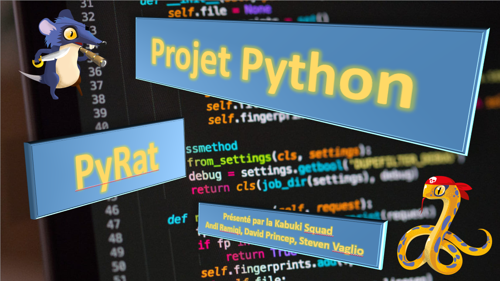

# 🧀 PyRat – Optimisation de parcours dans un labyrinthe

Projet réalisé dans le cadre du module **Algorithmie et Structures de Données** à la HEG Genève.

---

## 🎯 Objectif pédagogique

Ce projet a pour but d’apprendre à manipuler des **structures de données avancées** (graphes, files de priorité, nœuds liés) et d’analyser la **complexité algorithmique** à travers une problématique ludique : collecter des fromages dans un labyrinthe généré aléatoirement en optimisant les mouvements.

Les objectifs sont :
- Comprendre le fonctionnement d’un graphe pondéré
- Implémenter des algorithmes classiques (ex: Dijkstra, A*)
- Structurer proprement un code en Python orienté objet
- Respecter les contraintes de performance
- Travailler en équipe sur un projet technique

---

## 🧑‍💻 Équipe

Projet de groupe réalisé à trois personnes, dans un cadre académique, avec soutiens en laboratoire et évaluation finale via un tournoi inter-groupes.

---

## Fonctionnement général

Le jeu PyRat simule un **labyrinthe vu comme un graphe pondéré**. Chaque case est un sommet, et chaque connexion valide (sans mur) est une arête. Certaines arêtes ont un coût plus élevé si elles traversent de la boue (2 à 10).

L’intelligence artificielle est constituée de deux méthodes :

- `preprocessing(...)` — appelée au début pour construire les structures de données et préparer les décisions
- `turn(...)` — appelée à chaque tour, elle retourne un mouvement (`UP`, `DOWN`, `LEFT`, `RIGHT`) selon notre stratégie

Le fichier `template.py` sert de base pour la création d’une IA personnalisée.

---


## 📌 Contraintes

- ❌ Aucun package externe (sauf NumPy)
- ⏱️ Temps max :
  - `preprocessing` : 3s
  - `turn` : 100ms
---

## Structure de données utilisée

Le cœur du projet repose sur notre propre représentation du labyrinthe en tant que graphe, via deux classes principales :

### 🔹 `Node` – Représente une case

```python
class Node:
    def __init__(self, position: (int, int), cheese: bool):
        self.__coordonnees__: tuple[int, int]
        self.__cheese__: bool
        self.__voisins__: dict[Node, int]  # voisin : coût
        self.__routes__: dict = {}
        self.__distances__: dict = {}
```

Chaque nœud connaît ses voisins accessibles (`up`, `down`, `left`, `right`), et stocke les coûts d’accès. Il peut contenir un fromage.

---

### 🔹 `Graph` – Représente l’ensemble du labyrinthe

```python
class Graph:
    def __init__(self, map: dict, playerLocation: (int, int), opponentLocation: (int, int), piecesOfCheese: list[(int, int)]):
        self.playerLocation
        self.opponentLocation
        self.ListNodes
        self.set_fromages(piecesOfCheese)
```

Le graphe est construit à partir de `mazeMap` (un dictionnaire de connexions entre tuples `(x, y)`), et permet de préparer des parcours efficaces vers les fromages.

---

## Stratégie mise en œuvre

Notre IA repose sur l’implémentation de **Dijkstra**.  
L’approche cherche à :

- construire un graphe complet à partir de `mazeMap`
- analyser tous les chemins vers les fromages disponibles
- éviter les zones coûteuses (boue)
- adapter dynamiquement la cible si un autre joueur est présent

---

## 🚀 Exemples de lancement

### Partie solo IA :
```bash
python pyrat.py --rat AIs/mon_ai.py
```

### Duel IA vs IA :
```bash
python pyrat.py --rat AIs/mon_ai.py --python AIs/random.py
```

### Désactiver les animations (si besoin) :
```bash
python pyrat.py --rat AIs/mon_ai.py --desactivate_animations
```

---

## 📁 Arborescence du projet

```
├── AIs/
│   ├── mon_ai.py            # Notre IA principale
│   ├── template.py          # Fichier de base (fourni)
├── imports/
│   └── parameters.py        # Paramètres de génération du labyrinthe
├── pyrat.py                 # Lancement du jeu
├── README.md                # Ce fichier
```

---

## 🧠 Compétences mobilisées

- Programmation orientée objet
- Manipulation de graphes et algorithmes classiques (Dijkstra, A*)
- Construction de structures de données personnalisées
- Analyse de complexité
- Collaboration et gestion de version avec GitHub

---

## 📎 Liens utiles

- [Dijkstra – Brilliant](https://brilliant.org/wiki/dijkstras-short-path-finder/)
- [A* simplifié (YouTube)](https://www.youtube.com/watch?v=ySN5Wnu88nE)
- [Cours officiel PyRat](http://formations.telecom-bretagne.eu/pyrat/)
